# ExTrip

<span></span>
&nbsp;
<span></span>
&nbsp;

A simple travel app for booking hotels for iOS. *Made by [Jacob](https://github.com/jacob-nguyen-goldenowl)*

## UI Design 

<br />

***Click to View Extrip app Design from*** [[ExTrip]](https://www.figma.com/file/FfvKrAkefsdYNvYlPAZaYu/Trip-Go-Travel-UI-Kit-(Community)?node-id=0%3A2419&t=ttzrCNvNkCMJVNu0-0)

<br />

## Screenshot

| Home                                  | WishList                                  | Booking Tracker                             | Destination                                  | Detail                                  |
| ------------------------------------- | ---------------------------------------- | ------------------------------------- | ------------------------------------ | --------------------------------------- |
|  | 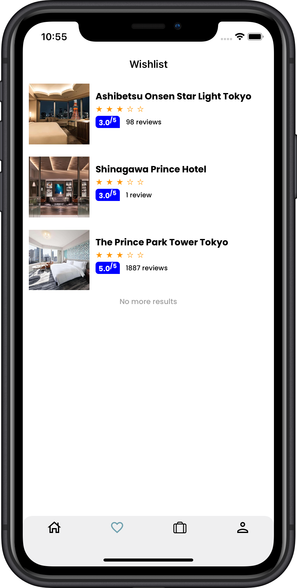 | 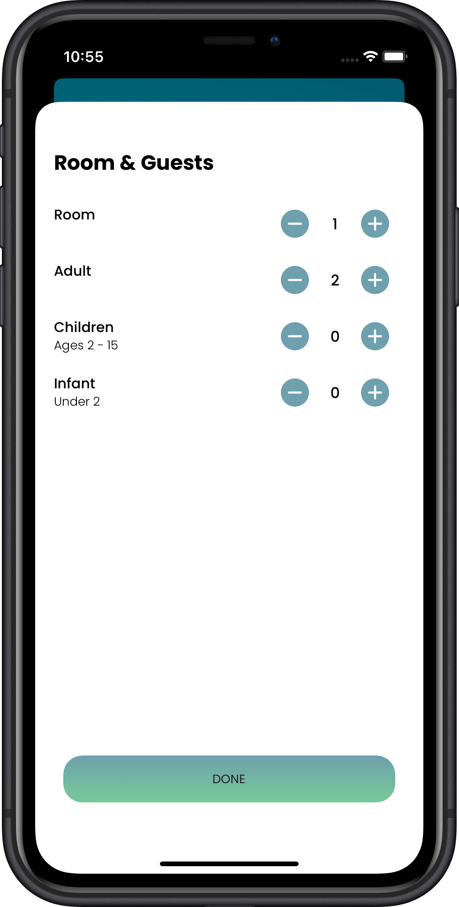 | 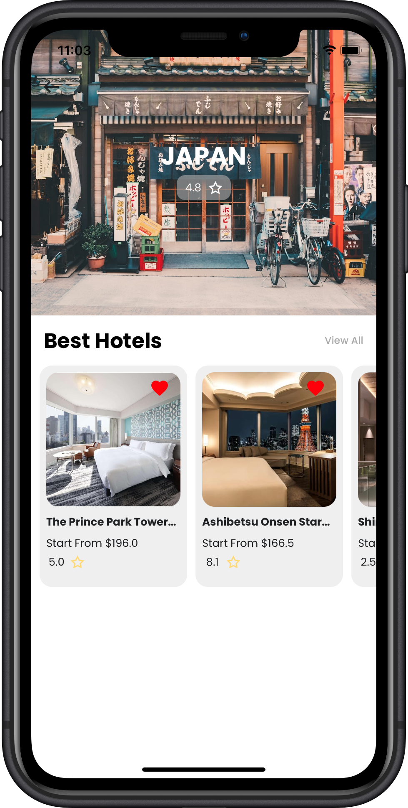 | 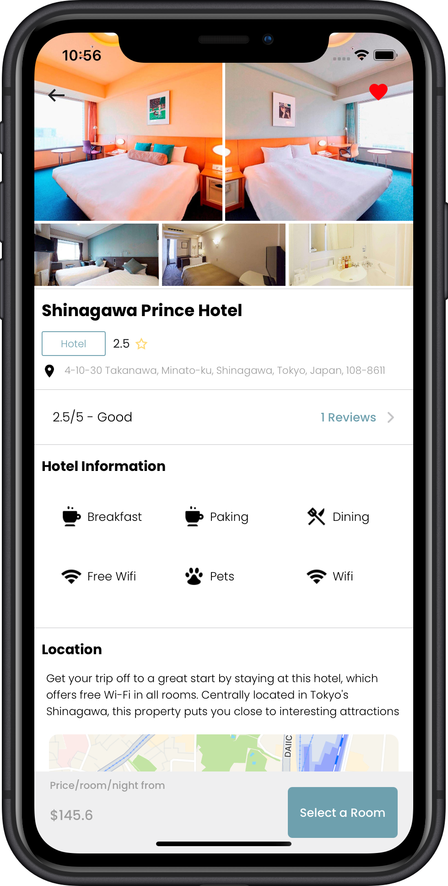 |

| Booking Room                                  | Review and Book                                  | Room                                  | Payment                                  | Confirm payment                                  |
| ------------------------------------------ | ------------------------------------------------ | --------------------------------------- | ---------------------------------------- | ------------------------------------- |
| 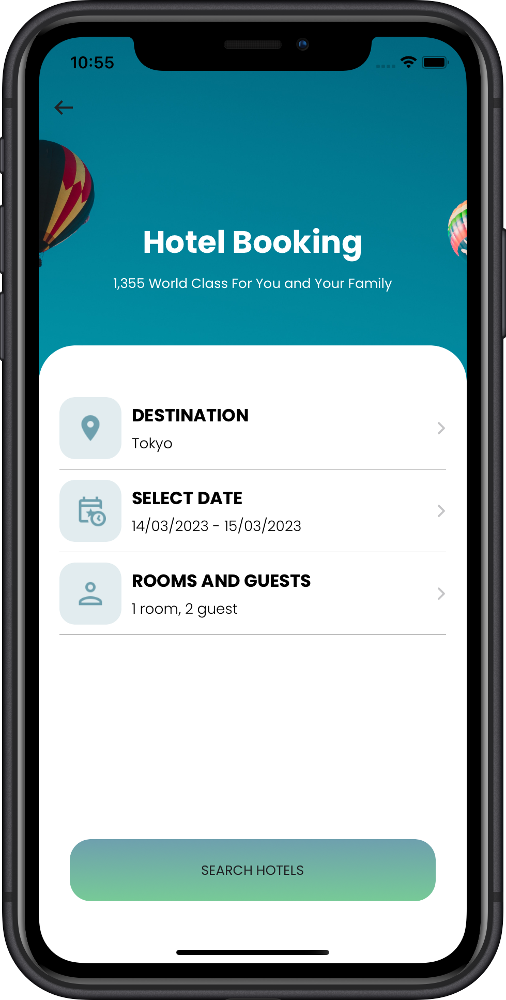 | 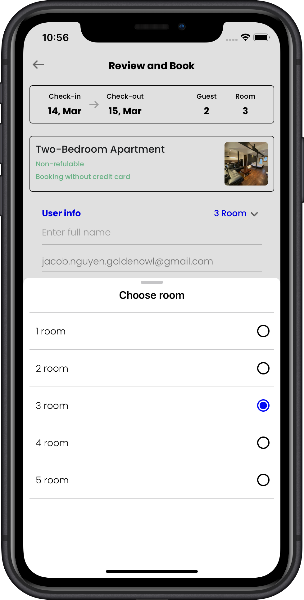 | 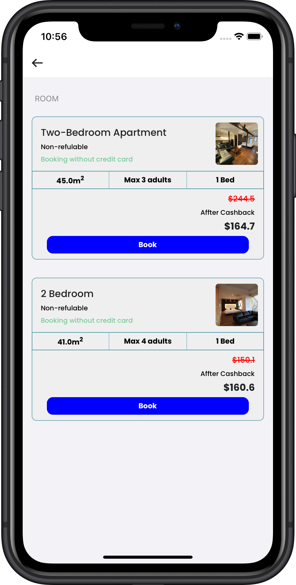 | 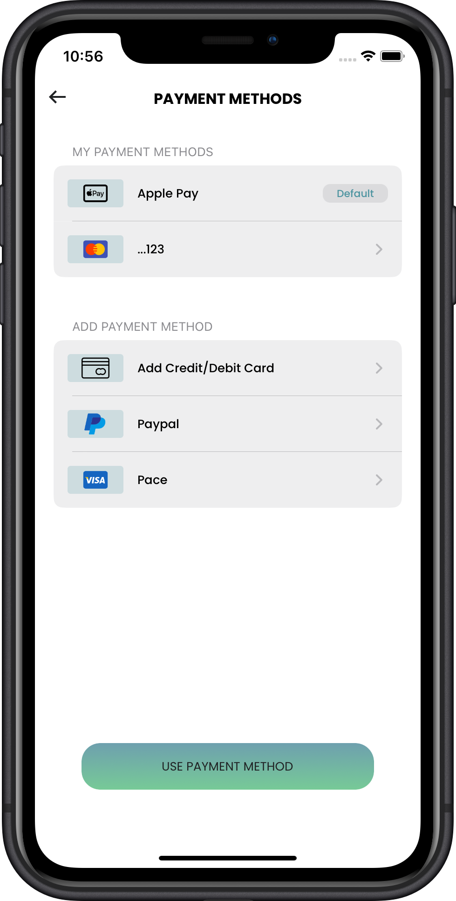 | 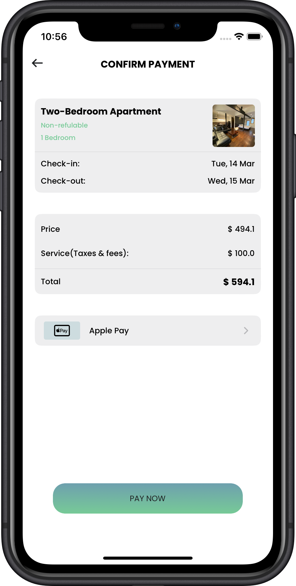 |

| Profile                                 | Search                                  | View all                                   | Filter                               | Select date                                     |
| ---------------------------------------- | -------------------------------------- | ------------------------------------------- | --------------------------------------- | ------------------------------------------ |
| 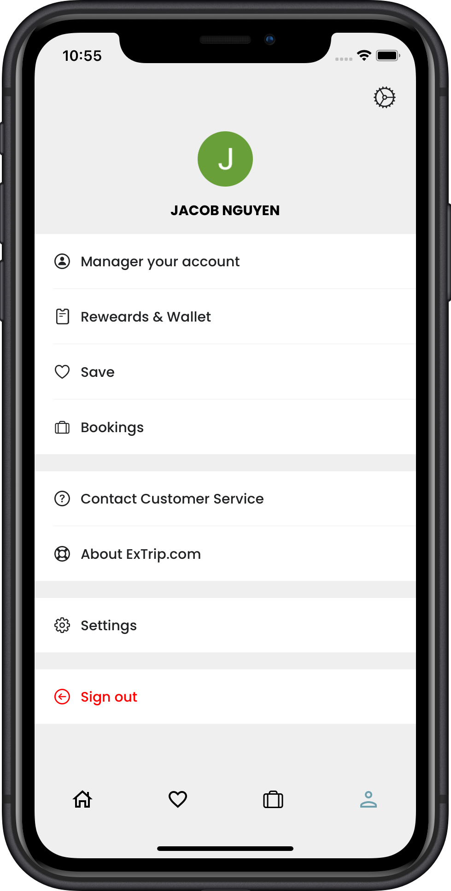 | 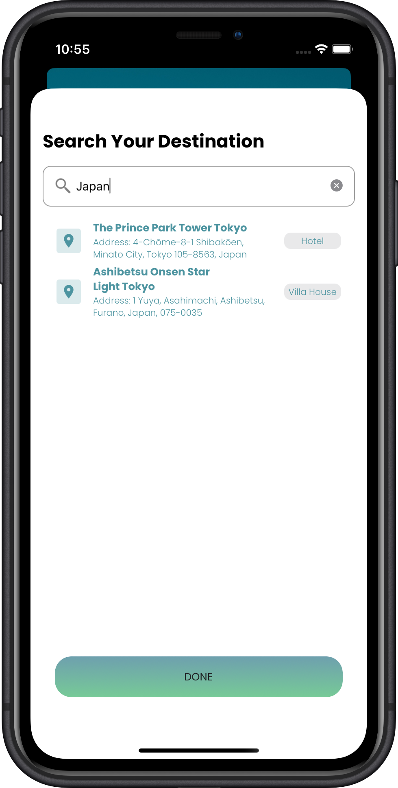 | 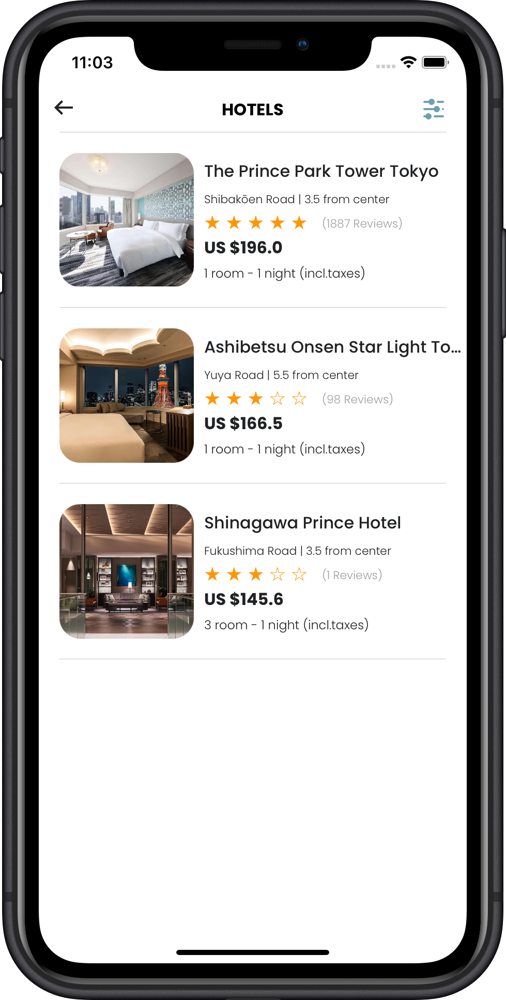 | 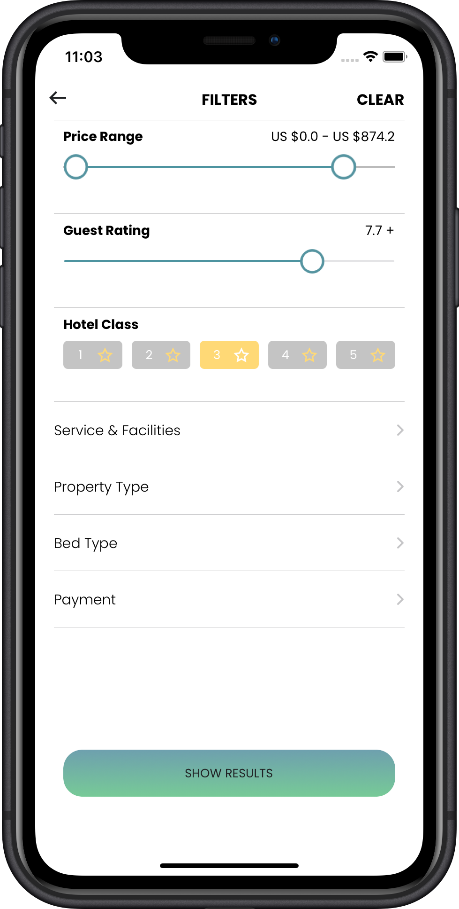 | 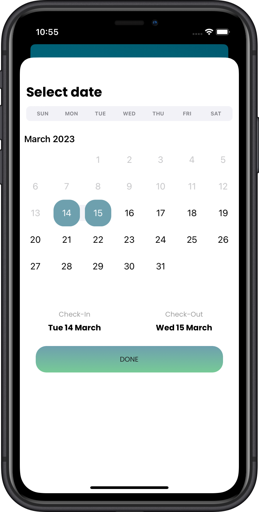 |

<br />

## Structure

```
Extrip
├── Common
│   ├── AsyncImage
│   ├── Constant
│   ├── ImageCache
│   └── Observable
├── Controllers
│   ├── Auth
│   ├── Booking
│   ├── Confirm
│   ├── Destination
│   ├── Detail
│   ├── Filter
│   ├── Home
│   ├── HotelBooking
│   ├── Main
│   ├── More
│   ├── Payment
│   ├── Profile
│   ├── ReviewBook
│   ├── Room
│   └── Wishlist
├── Customs
│   ├── Button
│   ├── ButtonStyle
│   ├── Label
│   ├── Slider
│   └── TextField
├── Extensions
│   ├── Date
│   ├── Double
│   ├── Font
│   ├── String
│   ├── UIImage
│   ├── UILabel
│   ├── UINavigation
│   ├── UIStackView
│   └── UIView
├── Framework
│   └── Calender
├── Model
│   ├── Booking
│   ├── Home
│   ├── Hotel
│   ├── User
│   └── Wishlist
├── Navigation
│   └── TabBar
├── Networking
│   ├── AuthService
│   ├── DatabaseManager
│   ├── Request
│   └── Response
├── Resources
│   ├── Assets.xcassets
│   ├── Colors
│   ├── Fonts
│   └── Lotties
├── ViewModel
│   ├── Auth
│   ├── Booking
│   ├── Filter
│   ├── Home
│   ├── Profile
│   ├── Root
│   └── WishList
└── Views
    ├── Back
    ├── EmptyView
    ├── Error
    ├── Header
    ├── Loading
    ├── Onboarding
    ├── Ratting
    └── Search

```

<br />

## Data structure
```
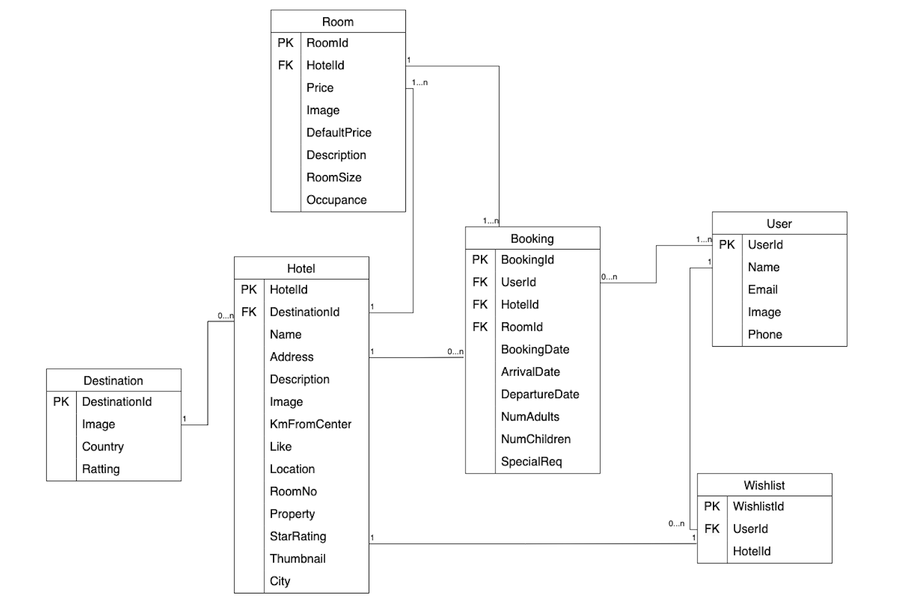
```
<br />

## Requirements

- iOS 15.0+
- Xcode 14.0+
- Cocoapods 1.12.0

<br />

## Installation
​
### Github Repo

You can clone the *[Extrip Git Repo](https://github.com/jacob-nguyen-goldenowl/ExTrip.git)* and go to project folder

### CocoaPods

Install pod dependencies to your project:

```
pod install
```  

## Usage

1. Open Extrip.xcworkspace and run​

2. Login with account
    - Test account: Test@gmail.com
    - Password: 123456

## Built With 

- UI Libraries

  - [JTAppleCalendar](https://github.com/patchthecode/JTAppleCalendar.git) -  Swift calendar Library. iOS calendar Control .
  - [Lottie](https://github.com/airbnb/lottie-ios) - An iOS library to natively render After Effects vector animations.
  - [Cosmos](https://github.com/evgenyneu/Cosmos.git) - A star rating control for iOS/tvOS written in Swift.
  - [AORangeSlider](https://github.com/Andy1984/AORangeSlider.git)  - AORangeSlider is a custom UISlider with two handlers to pick a minimum and a maximum range.
  
- Logics Libraries
  - [SwiftLint](https://github.com/realm/SwiftLint.git) - A tool to enforce Swift style and conventions.  

<br />

## UI References
- https://github.com/simla-tech/Fastis
- https://github.com/Shadberrow/YVTextField
- https://github.com/zoonooz/ZFRippleButton

<br />

## Resources

- https://icons8.com/
- https://lottiefiles.com/
- https://www.canva.com/

## License

```
    Apache 2.0 License


    Copyright 2022 Jacob Nguyen

    Licensed under the Apache License, Version 2.0 (the "License");
    you may not use this file except in compliance with the License.
    You may obtain a copy of the License at

       http://www.apache.org/licenses/LICENSE-2.0

    Unless required by applicable law or agreed to in writing, software
    distributed under the License is distributed on an "AS IS" BASIS,
    WITHOUT WARRANTIES OR CONDITIONS OF ANY KIND, either express or implied.
    See the License for the specific language governing permissions and
    limitations under the License.
```

